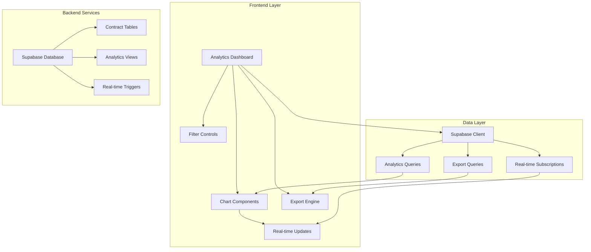
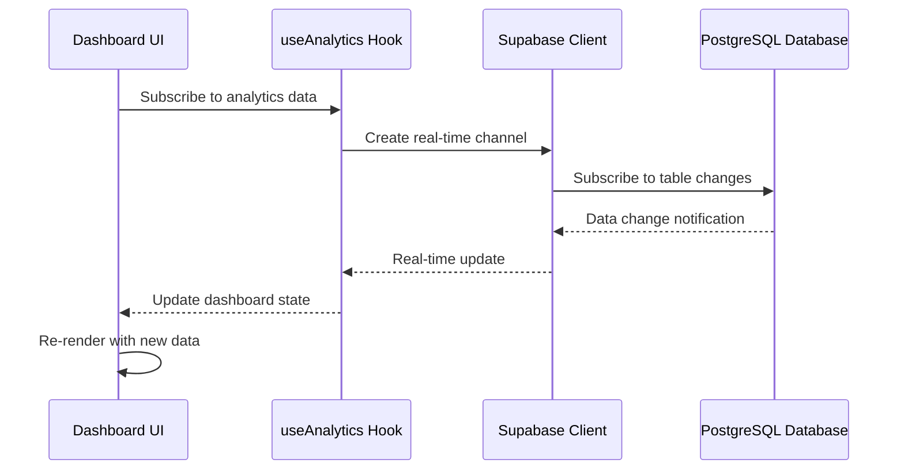

# Design Document: Advanced Contract Analytics

## Overview

The Advanced Contract Analytics feature provides a comprehensive business intelligence platform for the ISOTEC Photovoltaic Contract System. Built as a React-based dashboard using Next.js 15, TypeScript, and Tailwind CSS, it delivers real-time insights through interactive visualizations, detailed analytics, and customizable reporting capabilities.

The system leverages Supabase's real-time subscriptions for live data updates, implements a modular component architecture for maintainability, and integrates seamlessly with the existing admin interface while maintaining ISOTEC brand consistency.

## Architecture

### High-Level Architecture



### Component Architecture

The analytics system follows a layered architecture pattern:

1. **Presentation Layer**: React components for dashboards, charts, and controls
2. **Business Logic Layer**: Custom hooks for data management and real-time subscriptions
3. **Data Access Layer**: Supabase client with optimized queries and real-time channels
4. **Database Layer**: PostgreSQL with materialized views for performance

### Real-time Data Flow



## Components and Interfaces

### Core Components

#### AnalyticsDashboard Component
```typescript
interface AnalyticsDashboardProps {
  initialData?: AnalyticsData;
  dateRange?: DateRange;
  filters?: AnalyticsFilters;
}

interface AnalyticsData {
  overview: OverviewMetrics;
  revenue: RevenueMetrics;
  customers: CustomerMetrics;
  contracts: ContractMetrics;
  trends: TrendData[];
}
```

#### ChartContainer Component
```typescript
interface ChartContainerProps {
  title: string;
  data: ChartData;
  type: 'line' | 'bar' | 'pie' | 'area';
  realTime?: boolean;
  exportable?: boolean;
  height?: number;
}

interface ChartData {
  labels: string[];
  datasets: Dataset[];
  metadata?: ChartMetadata;
}
```

#### FilterPanel Component
```typescript
interface FilterPanelProps {
  filters: AnalyticsFilters;
  onFiltersChange: (filters: AnalyticsFilters) => void;
  availableOptions: FilterOptions;
}

interface AnalyticsFilters {
  dateRange: DateRange;
  contractTypes: string[];
  customerSegments: string[];
  regions?: string[];
}
```

#### ExportManager Component
```typescript
interface ExportManagerProps {
  data: ExportableData;
  formats: ExportFormat[];
  onExport: (format: ExportFormat, options: ExportOptions) => Promise<void>;
}

interface ExportOptions {
  includeCharts: boolean;
  dateRange: DateRange;
  selectedMetrics: string[];
  format: 'pdf' | 'excel' | 'csv';
}
```

### Custom Hooks

#### useAnalyticsData Hook
```typescript
interface UseAnalyticsDataReturn {
  data: AnalyticsData | null;
  loading: boolean;
  error: Error | null;
  refresh: () => Promise<void>;
  subscribe: (filters: AnalyticsFilters) => void;
  unsubscribe: () => void;
}

function useAnalyticsData(
  filters: AnalyticsFilters,
  realTime: boolean = true
): UseAnalyticsDataReturn;
```

#### useRealTimeUpdates Hook
```typescript
interface UseRealTimeUpdatesReturn {
  isConnected: boolean;
  lastUpdate: Date | null;
  connectionStatus: 'connected' | 'disconnected' | 'reconnecting';
  subscribe: (channel: string, callback: (data: any) => void) => void;
  unsubscribe: (channel: string) => void;
}

function useRealTimeUpdates(): UseRealTimeUpdatesReturn;
```

### Service Interfaces

#### AnalyticsService
```typescript
interface AnalyticsService {
  getOverviewMetrics(filters: AnalyticsFilters): Promise<OverviewMetrics>;
  getRevenueAnalytics(filters: AnalyticsFilters): Promise<RevenueMetrics>;
  getCustomerInsights(filters: AnalyticsFilters): Promise<CustomerMetrics>;
  getContractLifecycle(filters: AnalyticsFilters): Promise<ContractMetrics>;
  getTrendAnalysis(filters: AnalyticsFilters): Promise<TrendData[]>;
  exportData(options: ExportOptions): Promise<ExportResult>;
}
```

#### RealtimeService
```typescript
interface RealtimeService {
  subscribe(channel: string, callback: (data: any) => void): Subscription;
  unsubscribe(subscription: Subscription): void;
  getConnectionStatus(): ConnectionStatus;
  reconnect(): Promise<void>;
}
```

## Data Models

### Analytics Data Models

#### OverviewMetrics
```typescript
interface OverviewMetrics {
  totalContracts: number;
  activeContracts: number;
  completedContracts: number;
  totalRevenue: number;
  monthlyRecurringRevenue: number;
  averageContractValue: number;
  customerCount: number;
  growthRate: number;
  periodComparison: PeriodComparison;
}

interface PeriodComparison {
  contracts: PercentageChange;
  revenue: PercentageChange;
  customers: PercentageChange;
}

interface PercentageChange {
  value: number;
  percentage: number;
  trend: 'up' | 'down' | 'stable';
}
```

#### RevenueMetrics
```typescript
interface RevenueMetrics {
  totalRevenue: number;
  monthlyRevenue: MonthlyRevenue[];
  revenueByType: RevenueBreakdown[];
  revenueBySegment: RevenueBreakdown[];
  profitMargins: ProfitMargin[];
  forecastData: ForecastPoint[];
}

interface MonthlyRevenue {
  month: string;
  revenue: number;
  contracts: number;
  averageValue: number;
}

interface RevenueBreakdown {
  category: string;
  amount: number;
  percentage: number;
  growth: number;
}
```

#### CustomerMetrics
```typescript
interface CustomerMetrics {
  totalCustomers: number;
  newCustomers: number;
  retentionRate: number;
  churnRate: number;
  customerSegments: CustomerSegment[];
  acquisitionTrends: AcquisitionTrend[];
  lifetimeValue: number;
}

interface CustomerSegment {
  name: string;
  count: number;
  averageValue: number;
  retentionRate: number;
  characteristics: string[];
}
```

#### ContractMetrics
```typescript
interface ContractMetrics {
  averageDuration: number;
  completionRate: number;
  stageProgression: StageMetrics[];
  riskAnalysis: RiskMetrics[];
  seasonalPatterns: SeasonalData[];
  conversionRates: ConversionRate[];
}

interface StageMetrics {
  stage: string;
  averageTime: number;
  completionRate: number;
  bottlenecks: string[];
}
```

### Database Schema Extensions

#### Analytics Views
```sql
-- Materialized view for performance metrics
CREATE MATERIALIZED VIEW contract_analytics AS
SELECT 
  DATE_TRUNC('month', created_at) as month,
  contract_type,
  COUNT(*) as contract_count,
  SUM(contract_value) as total_value,
  AVG(contract_value) as average_value,
  AVG(EXTRACT(days FROM completed_at - created_at)) as avg_duration
FROM contracts 
WHERE created_at >= NOW() - INTERVAL '2 years'
GROUP BY month, contract_type;

-- Real-time triggers for analytics updates
CREATE OR REPLACE FUNCTION notify_analytics_update()
RETURNS trigger AS $$
BEGIN
  PERFORM pg_notify('analytics_update', json_build_object(
    'table', TG_TABLE_NAME,
    'operation', TG_OP,
    'data', row_to_json(NEW)
  )::text);
  RETURN NEW;
END;
$$ LANGUAGE plpgsql;
```

## Correctness Properties

*A property is a characteristic or behavior that should hold true across all valid executions of a system—essentially, a formal statement about what the system should do. Properties serve as the bridge between human-readable specifications and machine-verifiable correctness guarantees.*

### Property Reflection

After analyzing the acceptance criteria, I identified several properties that can be consolidated to eliminate redundancy:

- Properties 1.1, 2.1, 3.1, and 4.1 all test component rendering with required elements - these can be combined into a comprehensive rendering property
- Properties 2.2 and 2.5 both test data filtering and breakdown - these can be combined into a single filtering property
- Properties 5.1, 5.2, and 5.5 all test comparison and analysis capabilities - these can be combined into a comprehensive comparison property

### Core Properties

**Property 1: Dashboard Component Completeness**
*For any* valid analytics data set, when rendering dashboard components (overview, revenue, customer insights, lifecycle), all required metrics and elements should be present in the rendered output
**Validates: Requirements 1.1, 2.1, 3.1, 4.1**

**Property 2: Percentage Change Calculations**
*For any* current period data and previous period data, the calculated percentage changes should be mathematically correct and properly formatted
**Validates: Requirements 1.4**

**Property 3: Revenue Analytics Filtering**
*For any* combination of filters (date ranges, contract types, customer segments), the filtered revenue data should only contain records matching all applied filter criteria
**Validates: Requirements 2.2, 2.5**

**Property 4: Profit Margin Calculations**
*For any* revenue and cost data, the calculated profit margins should be mathematically accurate and properly categorized by contract type
**Validates: Requirements 2.3**

**Property 5: Customer Segmentation Logic**
*For any* customer data set, customers should be correctly categorized into segments based on contract value, duration, and engagement level thresholds
**Validates: Requirements 3.2**

**Property 6: Customer Behavior Pattern Recognition**
*For any* customer contract history, the system should correctly identify renewal patterns and upgrade/downgrade trends
**Validates: Requirements 3.3**

**Property 7: Customer Segment Ranking**
*For any* set of customer segments with performance metrics, the top-performing segments should be correctly identified and ranked
**Validates: Requirements 3.4**

**Property 8: Contract Risk Identification**
*For any* contract with processing times exceeding historical norms, the system should correctly identify it as at-risk
**Validates: Requirements 4.2**

**Property 9: Stage Conversion Rate Calculations**
*For any* contract stage transition data, the calculated conversion rates between stages should be mathematically accurate
**Validates: Requirements 4.3**

**Property 10: Contract Alert Generation**
*For any* contract exceeding normal processing time thresholds, appropriate alerts should be generated
**Validates: Requirements 4.4**

**Property 11: Seasonal Pattern Detection**
*For any* time-series contract data spanning multiple seasons, seasonal patterns should be correctly identified and displayed
**Validates: Requirements 4.5**

**Property 12: Performance Comparison Calculations**
*For any* metric data and comparison periods (year-over-year, month-over-month, quarter-over-quarter), the comparison calculations should be mathematically correct
**Validates: Requirements 5.1, 5.2, 5.5**

**Property 13: Anomaly Detection**
*For any* performance data with statistical outliers, significant differences and anomalies should be correctly identified and highlighted
**Validates: Requirements 5.3**

**Property 14: Forecasting Accuracy**
*For any* historical trend data, generated forecasts should follow mathematically sound forecasting algorithms
**Validates: Requirements 5.4**

**Property 15: Export Format Compliance**
*For any* export request, the generated file should be in the correct format (PDF, Excel, CSV) and contain the requested data
**Validates: Requirements 6.1**

**Property 16: Export Data Filtering**
*For any* custom export with selected metrics and date ranges, the exported data should only include the specified metrics and time periods
**Validates: Requirements 6.4**

**Property 17: Real-time Change Highlighting**
*For any* data update in real-time visualizations, changed values should be visually highlighted with appropriate indicators
**Validates: Requirements 7.3**

**Property 18: Connection Error Handling**
*For any* connection failure scenario, the system should display appropriate connection status and attempt automatic reconnection
**Validates: Requirements 7.5**

**Property 19: Navigation Integration**
*For any* analytics page access, navigation links should be properly integrated into the existing admin menu structure
**Validates: Requirements 8.1**

**Property 20: Authentication Inheritance**
*For any* analytics dashboard access attempt, authentication and authorization should be properly enforced using the existing admin system
**Validates: Requirements 8.2**

**Property 21: Error Handling Integration**
*For any* error that occurs in the analytics dashboard, it should be handled using the existing admin system's error handling and notification mechanisms
**Validates: Requirements 8.5**

<function_calls>
<invoke name="prework">
<parameter name="featureName">advanced-contract-analytics

## Error Handling

### Error Categories

#### Data Loading Errors
- **Network Failures**: Handle Supabase connection issues with retry logic and fallback states
- **Query Timeouts**: Implement timeout handling for long-running analytics queries
- **Data Validation Errors**: Validate incoming data and handle malformed responses gracefully

#### Real-time Connection Errors
- **WebSocket Disconnections**: Automatic reconnection with exponential backoff
- **Subscription Failures**: Graceful degradation to polling when real-time fails
- **Channel Errors**: Error recovery for specific channel subscription failures

#### Export Generation Errors
- **File Generation Failures**: Handle PDF/Excel generation errors with user feedback
- **Large Dataset Timeouts**: Implement chunked processing for large exports
- **Format Conversion Errors**: Validate data before format conversion

#### Authentication and Authorization Errors
- **Session Expiration**: Redirect to login with return URL preservation
- **Permission Denied**: Display appropriate access denied messages
- **Role-based Access**: Enforce feature-level permissions consistently

### Error Handling Patterns

```typescript
interface ErrorBoundaryState {
  hasError: boolean;
  error: Error | null;
  errorInfo: ErrorInfo | null;
}

class AnalyticsErrorBoundary extends Component<Props, ErrorBoundaryState> {
  static getDerivedStateFromError(error: Error): ErrorBoundaryState {
    return {
      hasError: true,
      error,
      errorInfo: null
    };
  }

  componentDidCatch(error: Error, errorInfo: ErrorInfo) {
    // Log error to monitoring service
    this.logErrorToService(error, errorInfo);
  }
}
```

### Retry and Fallback Strategies

```typescript
const useAnalyticsWithRetry = (filters: AnalyticsFilters) => {
  const [retryCount, setRetryCount] = useState(0);
  const maxRetries = 3;
  
  const fetchWithRetry = useCallback(async () => {
    try {
      return await analyticsService.getData(filters);
    } catch (error) {
      if (retryCount < maxRetries) {
        setRetryCount(prev => prev + 1);
        // Exponential backoff
        await new Promise(resolve => 
          setTimeout(resolve, Math.pow(2, retryCount) * 1000)
        );
        return fetchWithRetry();
      }
      throw error;
    }
  }, [filters, retryCount]);
};
```

## Testing Strategy

### Dual Testing Approach

The Advanced Contract Analytics feature requires both unit testing and property-based testing to ensure comprehensive coverage:

**Unit Tests**: Focus on specific examples, edge cases, and integration points
- Component rendering with specific data sets
- Error boundary behavior with known error conditions
- Export functionality with sample data
- Authentication integration with mock scenarios
- Real-time connection handling with simulated failures

**Property Tests**: Verify universal properties across all inputs
- Mathematical calculations (percentages, profit margins, conversion rates)
- Data filtering and segmentation logic
- Ranking and sorting algorithms
- Pattern recognition and anomaly detection
- Format compliance for exports

### Property-Based Testing Configuration

**Testing Library**: Use `fast-check` for TypeScript property-based testing
- Minimum 100 iterations per property test for thorough coverage
- Custom generators for analytics data, date ranges, and filter combinations
- Shrinking capabilities to find minimal failing examples

**Test Organization**:
```typescript
// Example property test structure
describe('Analytics Dashboard Properties', () => {
  it('should calculate percentage changes correctly', () => {
    fc.assert(fc.property(
      fc.record({
        current: fc.float({ min: 0, max: 1000000 }),
        previous: fc.float({ min: 0, max: 1000000 })
      }),
      (data) => {
        const result = calculatePercentageChange(data.current, data.previous);
        // Property: percentage change calculation should be mathematically correct
        const expected = ((data.current - data.previous) / data.previous) * 100;
        expect(result.percentage).toBeCloseTo(expected, 2);
      }
    ), { numRuns: 100 });
  });
});
```

**Test Tagging**: Each property test must reference its design document property
- Tag format: **Feature: advanced-contract-analytics, Property {number}: {property_text}**
- Example: **Feature: advanced-contract-analytics, Property 2: Percentage Change Calculations**

### Integration Testing

**Real-time Testing**: Test WebSocket connections and Supabase real-time subscriptions
- Mock Supabase client for controlled testing scenarios
- Test connection recovery and error handling
- Verify data synchronization across components

**Export Testing**: Validate file generation and format compliance
- Test PDF generation with various chart types
- Verify Excel export with complex data structures
- Validate CSV format compliance and data integrity

**Performance Testing**: Ensure dashboard loads within performance requirements
- Test with large datasets (10,000+ contracts)
- Measure real-time update performance
- Validate export generation times

### Testing Data Management

**Test Data Generation**: Create realistic test datasets
- Generate contract data with realistic distributions
- Create customer data with various segments
- Simulate seasonal patterns and trends

**Mock Services**: Mock external dependencies for reliable testing
- Supabase client with predictable responses
- Real-time subscription simulation
- Export service mocking for format testing

The testing strategy ensures that both specific scenarios (unit tests) and universal behaviors (property tests) are thoroughly validated, providing confidence in the system's correctness and reliability.