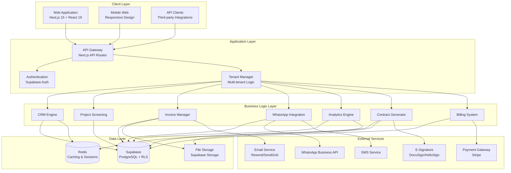
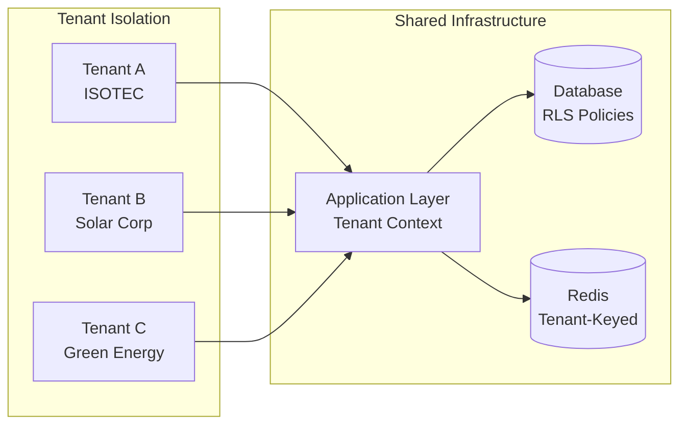
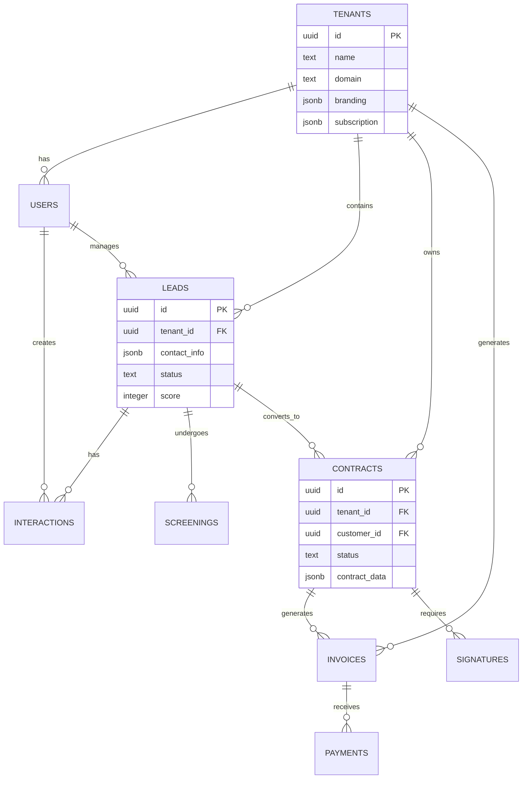

# Design Document: SolarCRM Pro Platform

## Overview

SolarCRM Pro is a comprehensive multi-tenant SaaS platform built on Next.js 15, React 19, and TypeScript, designed to transform the solar energy industry's approach to customer relationship management and contract generation. The platform integrates advanced CRM capabilities, project screening, invoice management, WhatsApp Business communication, and analytics into a unified solution.

The architecture supports multiple deployment domains:
- **solarcrm.clubemkt.digital**: Main SaaS platform with full CRM and multi-tenant capabilities
- **contratofacil.clubemkt.digital**: Legacy contract generation system integration

## Architecture

### High-Level Architecture



### Multi-Tenant Architecture Pattern

The platform implements a **shared database, shared schema** multi-tenancy pattern with Row Level Security (RLS) for data isolation:



## Components and Interfaces

### 1. Tenant Management System

**Core Interfaces:**
```typescript
interface Tenant {
  id: string;
  name: string;
  domain: string;
  subdomain: string;
  branding: TenantBranding;
  subscription: SubscriptionPlan;
  settings: TenantSettings;
  created_at: Date;
  updated_at: Date;
}

interface TenantBranding {
  logo_url: string;
  primary_color: string;
  secondary_color: string;
  custom_css?: string;
  white_label: boolean;
}

interface TenantContext {
  tenant_id: string;
  user_id: string;
  permissions: Permission[];
  subscription_limits: SubscriptionLimits;
}
```

**Key Functions:**
- Tenant onboarding and provisioning
- Data isolation enforcement through RLS
- Custom branding application
- Subscription limit enforcement
- Cross-tenant security validation

### 2. Enhanced CRM System

**Core Interfaces:**
```typescript
interface Lead {
  id: string;
  tenant_id: string;
  contact_info: ContactInfo;
  source: LeadSource;
  status: LeadStatus;
  score: number;
  stage: PipelineStage;
  assigned_to: string;
  created_at: Date;
  updated_at: Date;
}

interface PipelineStage {
  id: string;
  name: string;
  order: number;
  conversion_probability: number;
  required_actions: string[];
}

interface CustomerInteraction {
  id: string;
  customer_id: string;
  type: InteractionType;
  channel: CommunicationChannel;
  content: string;
  metadata: Record<string, any>;
  created_at: Date;
}
```

**Key Functions:**
- Lead capture and qualification
- Pipeline stage management
- Lead scoring algorithms
- Communication history tracking
- Sales performance analytics
- Customer lifecycle management

### 3. Project Screening System

**Core Interfaces:**
```typescript
interface ProjectScreening {
  id: string;
  tenant_id: string;
  lead_id: string;
  questionnaire_responses: QuestionnaireResponse[];
  screening_score: number;
  feasibility_rating: FeasibilityRating;
  risk_assessment: RiskAssessment;
  recommendations: string[];
  created_at: Date;
}

interface QuestionnaireTemplate {
  id: string;
  tenant_id: string;
  name: string;
  version: string;
  questions: ScreeningQuestion[];
  scoring_rules: ScoringRule[];
}

interface ScreeningQuestion {
  id: string;
  type: QuestionType;
  text: string;
  options?: string[];
  weight: number;
  required: boolean;
  conditional_logic?: ConditionalLogic;
}
```

**Key Functions:**
- Dynamic questionnaire generation
- Automated scoring and qualification
- Risk assessment algorithms
- Project feasibility analysis
- Integration with CRM pipeline

### 4. Invoice Management System

**Core Interfaces:**
```typescript
interface Invoice {
  id: string;
  tenant_id: string;
  customer_id: string;
  contract_id?: string;
  invoice_number: string;
  items: InvoiceItem[];
  subtotal: number;
  tax_amount: number;
  total_amount: number;
  status: InvoiceStatus;
  due_date: Date;
  payment_terms: string;
  created_at: Date;
}

interface InvoiceTemplate {
  id: string;
  tenant_id: string;
  name: string;
  template_html: string;
  variables: TemplateVariable[];
  branding: TenantBranding;
}

interface PaymentRecord {
  id: string;
  invoice_id: string;
  amount: number;
  payment_method: string;
  transaction_id: string;
  status: PaymentStatus;
  processed_at: Date;
}
```

**Key Functions:**
- Automated invoice generation
- Customer approval workflows
- Payment gateway integration
- Invoice delivery automation
- Payment tracking and reconciliation

### 5. WhatsApp Business Integration

**Core Interfaces:**
```typescript
interface WhatsAppMessage {
  id: string;
  tenant_id: string;
  customer_phone: string;
  message_type: MessageType;
  content: string;
  template_id?: string;
  status: MessageStatus;
  sent_at: Date;
  delivered_at?: Date;
  read_at?: Date;
}

interface MessageTemplate {
  id: string;
  tenant_id: string;
  name: string;
  category: TemplateCategory;
  language: string;
  header?: TemplateComponent;
  body: TemplateComponent;
  footer?: TemplateComponent;
  buttons?: TemplateButton[];
  status: TemplateStatus;
}

interface WhatsAppWebhook {
  id: string;
  tenant_id: string;
  event_type: WebhookEventType;
  payload: Record<string, any>;
  processed: boolean;
  created_at: Date;
}
```

**Key Functions:**
- Automated notification delivery
- Two-way conversation management
- Template message management
- Webhook event processing
- Integration with CRM interactions

### 6. Analytics Engine

**Core Interfaces:**
```typescript
interface AnalyticsMetric {
  id: string;
  tenant_id: string;
  metric_name: string;
  metric_type: MetricType;
  value: number;
  dimensions: Record<string, string>;
  timestamp: Date;
}

interface Dashboard {
  id: string;
  tenant_id: string;
  name: string;
  widgets: DashboardWidget[];
  filters: DashboardFilter[];
  refresh_interval: number;
}

interface Report {
  id: string;
  tenant_id: string;
  report_type: ReportType;
  parameters: ReportParameters;
  data: Record<string, any>;
  generated_at: Date;
  expires_at: Date;
}
```

**Key Functions:**
- Real-time metrics collection
- Multi-dimensional analytics
- Custom dashboard creation
- Automated report generation
- Predictive analytics and forecasting

### 7. Contract Generation Integration

**Core Interfaces:**
```typescript
interface ContractTemplate {
  id: string;
  tenant_id: string;
  name: string;
  version: string;
  template_content: string;
  variables: ContractVariable[];
  signature_fields: SignatureField[];
  approval_workflow: ApprovalStep[];
}

interface Contract {
  id: string;
  tenant_id: string;
  customer_id: string;
  template_id: string;
  contract_data: Record<string, any>;
  status: ContractStatus;
  signature_status: SignatureStatus;
  generated_at: Date;
  signed_at?: Date;
  expires_at?: Date;
}

interface SignatureRequest {
  id: string;
  contract_id: string;
  signer_email: string;
  signer_name: string;
  signature_url: string;
  status: SignatureStatus;
  signed_at?: Date;
}
```

**Key Functions:**
- Template-based contract generation
- Dynamic content population
- E-signature integration
- Contract lifecycle tracking
- Version control and audit trails

## Data Models

### Database Schema Design

The platform uses Supabase PostgreSQL with Row Level Security (RLS) for multi-tenant data isolation:

```sql
-- Core tenant table
CREATE TABLE tenants (
  id UUID PRIMARY KEY DEFAULT gen_random_uuid(),
  name TEXT NOT NULL,
  domain TEXT UNIQUE NOT NULL,
  subdomain TEXT UNIQUE NOT NULL,
  branding JSONB NOT NULL DEFAULT '{}',
  subscription JSONB NOT NULL DEFAULT '{}',
  settings JSONB NOT NULL DEFAULT '{}',
  created_at TIMESTAMPTZ DEFAULT NOW(),
  updated_at TIMESTAMPTZ DEFAULT NOW()
);

-- RLS policy example for leads table
CREATE TABLE leads (
  id UUID PRIMARY KEY DEFAULT gen_random_uuid(),
  tenant_id UUID REFERENCES tenants(id) NOT NULL,
  contact_info JSONB NOT NULL,
  source TEXT NOT NULL,
  status TEXT NOT NULL,
  score INTEGER DEFAULT 0,
  stage_id UUID REFERENCES pipeline_stages(id),
  assigned_to UUID REFERENCES users(id),
  created_at TIMESTAMPTZ DEFAULT NOW(),
  updated_at TIMESTAMPTZ DEFAULT NOW()
);

-- Enable RLS
ALTER TABLE leads ENABLE ROW LEVEL SECURITY;

-- RLS policy for tenant isolation
CREATE POLICY tenant_isolation ON leads
  FOR ALL
  USING (tenant_id = current_setting('app.current_tenant_id')::UUID);
```

### Key Data Relationships



Now I need to use the prework tool to analyze the acceptance criteria before writing the Correctness Properties section:

<function_calls>
<invoke name="prework">
<parameter name="featureName">saas-platform-transformation
## Correctness Properties

*A property is a characteristic or behavior that should hold true across all valid executions of a system—essentially, a formal statement about what the system should do. Properties serve as the bridge between human-readable specifications and machine-verifiable correctness guarantees.*

### Property Reflection

After analyzing all acceptance criteria, several properties can be consolidated to eliminate redundancy:

- **Tenant Isolation Properties**: Multiple criteria about tenant data isolation can be combined into comprehensive isolation properties
- **Integration Properties**: Various integration requirements can be consolidated into data consistency properties
- **Workflow Properties**: Similar workflow patterns across different modules can be unified
- **Analytics Properties**: Multiple analytics requirements can be combined into calculation accuracy properties

### Core Properties

**Property 1: Complete Tenant Data Isolation**
*For any* two different tenants and any data operation, data from one tenant should never be accessible to users or processes from another tenant, and all tenant-specific customizations should be applied correctly to their respective interfaces.
**Validates: Requirements 1.1, 1.2, 1.3, 1.5**

**Property 2: Billing and Usage Tracking Accuracy**
*For any* tenant and any platform usage activity, billing metrics should be tracked independently and accurately calculated according to the tenant's subscription plan and usage patterns.
**Validates: Requirements 1.4, 9.2, 9.4**

**Property 3: CRM Lead Lifecycle Integrity**
*For any* lead in the CRM system, all state transitions should maintain data integrity, preserve complete audit trails, and correctly calculate scores based on configured criteria.
**Validates: Requirements 2.1, 2.2, 2.3, 2.4, 2.5**

**Property 4: Project Screening Consistency**
*For any* project screening assessment, the system should generate consistent scores and recommendations based on questionnaire responses and maintain version control for template changes.
**Validates: Requirements 3.1, 3.2, 3.3, 3.5**

**Property 5: Cross-System Data Integration**
*For any* data that exists across multiple system components (CRM, Screening, Contracts, Invoices), updates in one system should be properly synchronized to all related systems maintaining data consistency.
**Validates: Requirements 3.4, 4.5, 7.5**

**Property 6: Invoice Generation and Payment Processing**
*For any* invoice generation request, the system should create properly formatted invoices using correct tenant branding, implement approval workflows when required, and accurately track payment status.
**Validates: Requirements 4.1, 4.2, 4.3, 4.4**

**Property 7: WhatsApp Communication Reliability**
*For any* WhatsApp communication event, messages should be delivered correctly, conversation history should be maintained, and all interactions should be integrated with the CRM system.
**Validates: Requirements 5.1, 5.2, 5.3, 5.5**

**Property 8: Template Management and Compliance**
*For any* template-based system (WhatsApp, Contracts, Invoices), template management should include proper approval workflows, version control, and compliance tracking.
**Validates: Requirements 5.4, 7.2**

**Property 9: Analytics Calculation Accuracy**
*For any* analytics request, calculations should be accurate, data should be properly isolated by tenant, and real-time metrics should reflect current system state.
**Validates: Requirements 6.1, 6.2, 6.3, 6.4, 6.5**

**Property 10: Contract Lifecycle Management**
*For any* contract in the system, the complete lifecycle from generation through execution should be tracked, e-signature integration should function correctly, and all contract data should be properly populated from CRM sources.
**Validates: Requirements 7.1, 7.3, 7.4**

**Property 11: User Permission Enforcement**
*For any* user action in the system, role-based access controls should be enforced immediately, audit trails should be maintained, and tenant boundaries should never be violated.
**Validates: Requirements 8.1, 8.2, 8.3, 8.4, 8.5**

**Property 12: Subscription Plan Management**
*For any* subscription plan configuration or change, the system should correctly apply plan limits, process payments automatically, and enable appropriate features based on the subscription tier.
**Validates: Requirements 9.1, 9.3, 9.5**

**Property 13: API Security and Functionality**
*For any* API request, proper authentication and authorization should be enforced, rate limiting should be applied according to subscription tiers, and webhook notifications should be delivered reliably.
**Validates: Requirements 10.1, 10.2, 10.4**

**Property 14: Data Migration Integrity**
*For any* data migration operation, all source data should be imported with complete integrity, audit trails should be maintained with source references, and validation reports should accurately reflect migration status.
**Validates: Requirements 11.1, 11.3, 11.4**

**Property 15: Legacy System Compatibility**
*For any* legacy ISOTEC workflow or process, the compatibility layer should maintain functional equivalence while supporting parallel operation during transition periods.
**Validates: Requirements 11.2, 11.5**

**Property 16: Security and Compliance Implementation**
*For any* data storage, transmission, or user authentication operation, appropriate encryption should be applied, audit logs should be maintained, and compliance reporting should be accurate.
**Validates: Requirements 12.1, 12.2, 12.3, 12.5**

## Error Handling

### Error Classification System

The platform implements a comprehensive error handling strategy with the following classifications:

**1. Tenant Isolation Errors**
- Cross-tenant data access attempts
- RLS policy violations
- Tenant context corruption
- Branding application failures

**2. Business Logic Errors**
- Invalid lead state transitions
- Screening score calculation failures
- Invoice generation errors
- Contract population failures

**3. Integration Errors**
- WhatsApp API failures
- Payment gateway errors
- E-signature service issues
- Email delivery failures

**4. Data Consistency Errors**
- Cross-system synchronization failures
- Audit trail corruption
- Version control conflicts
- Migration validation errors

### Error Recovery Strategies

**Graceful Degradation:**
- WhatsApp failures fall back to email notifications
- Payment processing errors trigger manual review workflows
- Analytics calculation errors return cached results with warnings

**Automatic Retry Logic:**
- Exponential backoff for external API calls
- Dead letter queues for failed webhook deliveries
- Background job retry mechanisms for data synchronization

**Data Integrity Protection:**
- Transaction rollback for multi-system operations
- Compensation transactions for distributed operations
- Audit trail preservation during error conditions

## Testing Strategy

### Dual Testing Approach

The platform requires both unit testing and property-based testing for comprehensive coverage:

**Unit Tests Focus:**
- Specific business logic examples
- Edge cases and error conditions
- Integration points between components
- User interface interactions
- API endpoint functionality

**Property-Based Tests Focus:**
- Universal properties across all inputs
- Tenant isolation guarantees
- Data consistency across systems
- Security and permission enforcement
- Cross-system integration reliability

### Property-Based Testing Configuration

**Testing Framework:** Fast-check for TypeScript/JavaScript property-based testing
**Test Configuration:**
- Minimum 100 iterations per property test
- Custom generators for domain-specific data types
- Shrinking enabled for minimal counterexample discovery

**Test Tagging Format:**
Each property test must include a comment with the format:
```typescript
// Feature: saas-platform-transformation, Property 1: Complete Tenant Data Isolation
```

### Testing Data Generators

**Custom Generators Required:**
- Tenant data with realistic branding and subscription configurations
- Lead data with various stages and interaction histories
- Contract templates with complex variable substitution
- Invoice data with multiple line items and tax calculations
- WhatsApp message templates with various component types

### Integration Testing Strategy

**Multi-Tenant Testing:**
- Parallel test execution with different tenant contexts
- Cross-tenant data isolation verification
- Tenant-specific customization validation

**External Service Testing:**
- Mock implementations for WhatsApp Business API
- Stripe test mode for payment processing
- Sandbox environments for e-signature services

**Performance Testing:**
- Load testing with multiple concurrent tenants
- Database query performance with RLS policies
- API rate limiting validation across subscription tiers

### Continuous Integration Requirements

**Pre-deployment Validation:**
- All property tests must pass with 100 iterations
- Unit test coverage minimum 80% for business logic
- Integration tests for all external service interactions
- Security scanning for dependency vulnerabilities
- Database migration testing with sample data

**Production Monitoring:**
- Real-time error tracking and alerting
- Performance monitoring for tenant isolation
- Audit log integrity verification
- External service availability monitoring